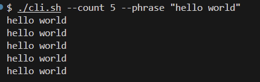

# Hello World Bash Script

This is a simple Bash script that prints a phrase a specified number of times, using command-line options to set those values.

## How It Works

1. **Command-line options**:
   - `--count` (or `-c`): How many times to print the phrase.
   - `--phrase` (or `-p`): The phrase to print.

2. **Function**:
   - `phrase_generator <count> <phrase>` loops `<count>` times and prints `<phrase>` each time.

3. **Script flow**:
   - The script parses the command-line options inside a `while [[ $# -gt 1 ]]` loop, storing values in the `COUNT` and `PHRASE` variables.
   - Once it has both `COUNT` and `PHRASE`, it calls `phrase_generator "${COUNT}" "${PHRASE}"`.

## Usage

```bash
# Make the script executable
chmod +x hello-world.sh

# Run the script with the required flags
./hello-world.sh --count 5 --phrase "Hello World"
```
## Screenshot

Here is a screenshot of the script in action:


